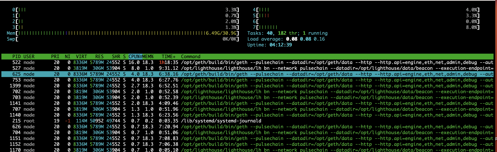

# PulseChain 验证节点设置脚本



这将帮助你自动设置运行在PulseChain 主网上的验证节点。由于它是 ETH 2.0 的分叉，所有相同的方法和脚本都可以修改以适用于在 Ethereum 上设置验证器。这个脚本既可以在你自己的硬件上运行，也可以在云服务器上运行。

请阅读所有的指令，因为它们会解释并告诉你如何运行这些脚本以及注意事项。

要在你的服务器上下载这些脚本，你需要安装 `git`，然后你可以执行 `git clone https://github.com/oursy/pulsechain-validator.git`

下载代码后，需要执行 `chmod +x *.sh` 以使所有脚本可执行并能在系统上运行。


# 安装 Geth,lighthouse-beacon,lighthouse-validator.service

## 用法

```shell
./pulsechain-validator-setup.sh [0x...YOUR NETWORK FEE ADDRESS] [12.89...YOUR SERVER IP ADDRESS]
```
## 命令行选项解释

- `NETWORK FEE ADDRESS`是 `--suggested-fee-recipient` 的 `FEE_RECIPIENT` 值，你希望在验证者提出新块时从用户那里收到优先费用的钱包地址（否则它会转到销毁地址）

- `SERVER_IP_ADDRESS`是你的验证器服务器的 IP 地址

注意：在整个过程中可能会提示您按 [Enter] 确定并至少继续该过程一次，因此这并不意味着完全无人值守的安装，但这可能取决于您的环境设置。

如果您在运行脚本时遇到错误并想再次运行脚本，可以使用重置脚本进行重置 [reset-validator](./reset-validator.sh)
> 按照过程大概持续20分钟，具体时间视服务器性能决定。

## 环境

具有 sudo 权限的非ROOT用户 , 在系统 `Ubuntu 22.04 Linux`上测试。

## 硬件
关于运行验证器的最低推荐要求的共识似乎是32GB RAM、2TB SSD磁盘和 8 个 vCPU 等。这些可以以购买或构建自己的服务器并支付前期成本、或从 VPS/云提供商（如 Amazon AWS）租用服务器并每月支付使用他们的平台和资源。两者各有优缺点以及不同的时间、货币和管理成本。

## 运行脚本后

该脚本自动执行了大约 85% 的配置验证器所需的工作，但是您仍然需要执行一些手动步骤来完成设置：在安全环境中生成密钥，将它们复制并导入到验证器上服务器，一旦您的客户端完全同步，请存入以在网络上激活您的验证器。

### 密钥生成的环境和硬件选项
- 使用另一台机器（备用笔记本电脑或设备）全新安装Ubuntu Linux，未连接到互联网（仅下载质押客户端）
- 全新安装的虚拟机（安全性较低，确保事后将其删除）
- 在云提供商上启动一个免费云实例（https://aws.amazon.com/free/free-tier-faqs/?nc1=h_ls）

使用存款工具生成验证器密钥并将其导入 **Lighthouse**

**运行质押存款客户端（在不同的机器上，详见下面的注释）**

```shell
$ sudo apt install -y python3-pip
$ git clone https://gitlab.com/pulsechaincom/staking-deposit-cli.git
$ cd staking-deposit-cli && pip3 install -r requirements.txt && sudo python3 setup.py install
$ ./deposit.sh new-mnemonic --chain=pulsechain --eth1_withdrawal_address=0x... (ENTER THE CORRECT WALLET ADDRESS TO WITHDRAWAL YOUR FUNDS)
```
**注意：使用您可以访问并且长期安全的提款钱包地址非常重要。否则您可能会损失所有存款资金。**

注意：在不同的安全机器上（不是在验证器服务器上）生成您的密钥，并将它们传输过来以供导入。AWS 甚至提供了一个免费套餐选项，允许您在一段时间内基本免费启动和使用 VM，因此您可以将其用于运行 Ubuntu Linux 的快速简单的小型 VM（不够强大，无法成为验证器，但适用于小任务和学习）。
```shell
sudo apt install -y unzip zip
zip -r validator_keys.zip validator_keys
base64 -w0 validator_keys.zip > validator_keys.b64
cat validator_keys.b64 (and copy the output)
```
**在你的验证服务器上**
```shell
cat > validator_keys.b64 <<EOF
Paste the output
[Enter] + type “EOF” + [Enter]
base64 -d validator_keys.b64 > validator_keys.zip
unzip validator_keys.zip
```

**然后按照那里的说明进行操作，将它们复制到验证器并作为节点用户（而不是 ec2 上的“ubuntu”用户）导入灯塔。**

```shell
$ sudo cp -R validator_keys /home/node
$ sudo chown -R node:node /home/node/validator_keys
$ sudo -u node bash

(as node user)
$ cd ~
$ /opt/lighthouse/lighthouse/lh account validator import --directory ~/validator_keys --network=pulsechain

enter password to import validator(s)

(exit and back as ubuntu user)
```

## 启动信标和验证器客户端
```shell
$ sudo systemctl daemon-reload
$ sudo systemctl enable lighthouse-beacon lighthouse-validator
$ sudo systemctl start lighthouse-beacon lighthouse-validator
```

如果你想查看 lighthouse 调试日志（类似于 geth）

```shell
$ journalctl -u lighthouse-beacon.service (with -f to get the latest logs OR without it to get the beginning logs)
$ journalctl -u lighthouse-validator.service
```

**一旦区块链客户端同步，您就可以进行 3200 万 PLS 存款（每个验证器）**

你可以在一台机器上有多个。在 https://launchpad.pulsechain.com 进行存款，以激活您的验证器并参与网络。

如果您在客户端完全同步并准备就绪之前进行存款，那么您将面临处罚，因为您的验证者将加入网络，但由于未同步，无法参与验证者职责（直到完全同步）。

## 调试

### 检查区块链同步进度

```shell
$ curl -s http://localhost:8545 -H "Content-Type: application/json" --data '{"jsonrpc":"2.0","method":"eth_syncing","params":[],"id":67}' | jq

{
  "jsonrpc": "2.0",
  "id": 67,
  "result": {
  "currentBlock": "0xffe4e3", // THIS IS WHERE YOU ARE
  "highestBlock": "0xffe8fa", // THIS IS WHERE YOU’RE GOING
  [full output was truncated for brevity]
  }
}
```
您可以将当前值与最高值进行比较，以了解您离完全同步还有多远。或者是 result=false，你就同步了。

```shell
$ curl -s http://localhost:8545 -H "Content-Type: application/json" --data "{\"jsonrpc\":\"2.0\",\"method\":\"eth_syncing\",\"params\":[],\"id\":67}" | jq
{
  "jsonrpc": "2.0",
  "id": 67,
  "result": false
}
```

###  lighthouse

```shell
$ curl -s http://localhost:5052/lighthouse/ui/health | jq
{
  "data": {
	"total_memory": XXXX,
	"free_memory": XXXX,
	"used_memory": XXXX,
	"os_version": "Linux XXXX",
	"host_name": "XXXX",
	"network_name": "XXXX",
	"network_bytes_total_received": XXXX,
	"network_bytes_total_transmit": XXXX,
	"nat_open": true,
	"connected_peers": 0, // PROBLEM
	"sync_state": "Synced"
  [full output was truncated for brevity]
  }
}
```

```shell
$ curl -s http://localhost:5052/lighthouse/syncing | jq
{
  "data": "Synced"
}
```

### 查看客户端服务状态

```shell
$ sudo systemctl status geth lighthouse-beacon lighthouse-validator

● geth.service - Geth (Go-Pulse)
     Loaded: loaded (/etc/systemd/system/geth.service; enabled; vendor preset: enabled)
     [some output truncated for brevity]

Apr 00 19:30:20 server geth[126828]: INFO Unindexed transactions blocks=1 txs=56   tail=14,439,524 elapsed=2.966ms
Apr 00 19:30:30 server geth[126828]: INFO Imported new potential chain segment blocks=1 txs=35   mgas=1.577  elapsed=21.435ms     mgasps=73.569  number=16,789,524 hash=xxxxd7..xxx>
Apr 00 19:30:30 server geth[126828]: INFO Chain head was updated                   number=16,789,xxx hash=xxxxd7..cdxxxx root=xxxx9c..03xxxx elapsed=1.345514ms
Apr 00 19:30:30 server geth[126828]: INFO Unindexed transactions blocks=1 txs=96   tail=14,439,xxx elapsed=4.618ms

● lighthouse-beacon.service - Lighthouse Beacon
     Loaded: loaded (/etc/systemd/system/lighthouse-beacon.service; enabled; vendor preset: enabled)
     [some output truncated for brevity]

Apr 00 19:30:05 server lighthouse[126782]: INFO Synced slot: 300xxx, block: 0x8355…xxxx, epoch: 93xx, finalized_epoch: 93xx, finalized_root: 0x667f…707b, exec_>

Apr 00 19:30:10 server lighthouse[126782]: INFO New block received root: 0xxxxxxxxxf5e1364e34de345ab72bf1632e814915eb3fdc888e5b83aaxxxxxxxx, slot: 300061

Apr 00 19:30:15 server lighthouse[126782]: INFO Synced slot: 300xxx, block: 0x681e…xxxx, epoch: 93xx, finalized_epoch: 93xx, finalized_root: 0x667f…707b, exec_>

● lighthouse-validator.service - Lighthouse Validator
     Loaded: loaded (/etc/systemd/system/lighthouse-validator.service; enabled; vendor preset: enabled)
     [some output truncated for brevity]

Apr 00 19:30:05 server lighthouse[126779]: Apr 06 19:30:05.000 INFO Connected to beacon node(s)             synced: X, available: X, total: X, service: notifier
Apr 00 19:30:05 server lighthouse[126779]: INFO All validators active slot: 300xxx, epoch: 93xx, total_validators: X, active_validators: X, current_epoch_proposers: 0, servic>
```
### 查看客户端调试日志

例如，journalctl会让您查看每个客户端的调试日志。推荐带有-f获取最新日志的选项。

```shell
$ journalctl -u geth.service
$ journalctl -u lighthouse-beacon.service
$ journalctl -u lighthouse-validator.service -f (with -f to get the latest logs OR without it get the beginning logs)
```


## 重置验证器脚本

```shell
reset-validator.sh
```

此帮助程序脚本会删除您所有的验证器数据，因此如果您想要全新安装或感觉自己犯了错误，您可以再次尝试设置。

当心！它会删除和重置内容，因此请阅读代码并确保在使用之前了解它的作用。

## 客户端更新脚本
```shell
update-client.sh
```
## 费用收件人和 IP 地址更新脚本

```shell
update-fee-ip-addr.sh
```
这允许您更新 Lighthouse 的网络费用收件人和服务器 IP 地址。这些是在初始 PulseChain 验证器设置期间指定的，但是它们都可能随着时间的推移而改变，因此脚本允许您轻松更新它们并重新启动客户端。

## 修剪 Geth 帮助脚本

```shell
prune-geth.sh
```

允许您修剪 geth 区块链数据以减少验证器上的磁盘空间使用。Erigon 会自动执行此操作，但为了维护，建议定期（每季度或每两年）修剪 Geth 以避免磁盘填满。

您还可以设置一个 cron 作业以每季度或 6 个月自动执行此操作，否则如果您不进行维护，根据您的磁盘大小，它可能会填满并导致您的验证器停止正常工作。

References
- https://geth.ethereum.org/docs/fundamentals/pruning
- https://www.coincashew.com/coins/overview-eth/guide-or-how-to-setup-a-validator-on-eth2-mainnet/part-ii-maintenance/pruning-the-execution-client-to-free-up-disk-space
- https://tecadmin.net/crontab-in-linux-with-20-examples-of-cron-schedule/


## 使用 Prometheus 和 Grafana 设置监控

`monitoring-setup.sh`和`reset-monitoring.sh`自动执行 `grafana` 和 `prometheus`的大部分设置，并让您分别重置（或删除）监控。

您需要首先运行验证程序设置脚本，然后使用监控设置脚本来“升级”带有监控的安装。

### 网络用户界面设置

运行监控设置脚本后，您必须在 Grafana 门户完成配置并导入仪表板。

标准配置假定您不与其他人（本地用户帐户）共享验证器服务器。否则，出于安全原因，建议在监控服务上设置进一步的身份验证。TL;DR 你应该是唯一一个可以远程访问你的验证器服务器的人，所以确保你的密钥和密码是安全的，不要以任何理由与任何人分享。

您可以设置 grafana 以在外部进行安全访问，而不是在防火墙上转发端口 3000 并将其向世界开放的不太安全的方式，这可能会使您的服务器在下次 Grafana 出现安全漏洞时面临风险，任何人都可以利用该漏洞.

```shell
ssh -i key.pem -N ubuntu@validator-server-IP -L 8080:localhost:3000
```
然后在你的电脑上打开一个浏览器窗口，自己登录到 grafana，不要将它暴露给外界

转到http://localhost:8080并使用 admin/admin（作为初始用户名/密码）登录。然后它会要求你设置一个新密码.


In the lower left bar area, click the gear box -> Data Sources -> Add Data Source.

Select Prometheus
URL: http://localhost:9090
Click Save & Test
It should say “Datasource is working” in green
Use your mouse cursor to hover over the Dashboards icon (upper left bar area, 4 squares icon).

Select Import
Upload each JSON dashboard
Geth

Download it @ https://gist.githubusercontent.com/karalabe/e7ca79abdec54755ceae09c08bd090cd/raw/3a400ab90f9402f2233280afd086cb9d6aac2111/dashboard.json to import
Name: Geth
Datasource: Prometheus (default)
Click Import
Click Save button (and confirm Save) in upper right toolbar
Repeat for next dashboard
Lighthouse VC

Download it @ https://raw.githubusercontent.com/sigp/lighthouse-metrics/master/dashboards/ValidatorClient.json to import
Name: Lighthouse VC
Datasource: Prometheus (default) (same steps as previous)
Lighthouse Beacon

Download it @ https://raw.githubusercontent.com/sigp/lighthouse-metrics/master/dashboards/Summary.json to import
Name: Lighthouse Beacon
Datasource: Prometheus (default) (same steps as previous)
There's also this ETH forked Dashboard for PulseChain @ https://github.com/raskitoma/pulse-staking-dashboard which has really good stats!

Staking Dashboard (one of the best ones)

Download it @ https://raw.githubusercontent.com/raskitoma/pulse-staking-dashboard/main/Yoldark_ETH_staking_dashboard.json to import
Name: Staking Dashboard
Datasource: Prometheus (default) (same steps as previous)
Now you can browse the Dashboards and see various stats and data!

Also see the guides below for additional help (scripts were mostly based on those instructions)

- https://www.coincashew.com/coins/overview-eth/guide-or-how-to-setup-a-validator-on-eth2-mainnet/part-i-installation/monitoring-your-validator-with-grafana-and-prometheus
- https://schh.medium.com/port-forwarding-via-ssh-ba8df700f34d
- https://github.com/raskitoma/pulse-staking-dashboard

You can also setup email alerts on Grafana. See guide at the link below.

- https://thriftly.io/docs/components/Thriftly-Deployment-Beyond-the-Basics/Metrics-Prometheus/Creating-Receiving-Email-Alerts.html


# Additional Resources and References
- https://gitlab.com/pulsechaincom
- https://gammadevops.substack.com/p/part-1-introduction-to-validator
- https://gitlab.com/davidfeder/validatorscript/-/blob/64f37685908a78c5337f8d3dc951f7f01f251697/PulseChain_V4_Script.txt
- https://gitlab.com/davidfeder/validatorscript/-/blob/5fa11c7f81d8292779774b8dff9144ec3e44d26a/PulseChain_V3_Script.txt
- https://www.hexpulse.info/docs/node-setup.html
- https://togosh.medium.com/pulsechain-validator-setup-guide-70edae00b344
- https://github.com/tdslaine/install_pulse_node
- https://gitlab.com/Gamesys10/pulsechain-node-guide
- https://lighthouse-book.sigmaprime.io/api-lighthouse.html
- https://lighthouse-book.sigmaprime.io/key-management.html
- https://docs.gnosischain.com/node/guide/validator/run/lighthouse
- https://ethereum.stackexchange.com/questions/394/how-can-i-find-out-what-the-highest-block-is
- https://www.coincashew.com/coins/overview-eth/guide-or-how-to-setup-a-validator-on-eth2-mainnet/part-i-installation/monitoring-your-validator-with-grafana-and-prometheus
- https://schh.medium.com/port-forwarding-via-ssh-ba8df700f34d
- https://www.youtube.com/watch?v=lbUnlIL_yLs&ab_channel=Oooly
- https://www.reddit.com/r/ethstaker/comments/txj5vh/technical_overview_of_validator_need_some_help/
- https://docs.prylabs.network/docs/troubleshooting/issues-errors
- https://pawelurbanek.com/ethereum-node-aws
- https://chasewright.com/getting-started-with-turbo-geth-on-ubuntu/
- https://docs.prylabs.network/docs/prysm-usage/p2p-host-ip
- https://www.blocknative.com/blog/an-ethereum-stakers-guide-to-slashing-other-penalties
- https://goerli.launchpad.ethstaker.cc/en/faq
- https://www.coincashew.com/coins/overview-eth/guide-or-how-to-setup-a-validator-on-eth2-mainnet/part-i-installation/guide-or-security-best-practices-for-a-eth2-validator-beaconchain-node
- https://ethereum.stackexchange.com/questions/3887/how-to-reduce-the-chances-of-your-ethereum-wallet-getting-hacked
- https://docs.prylabs.network/docs/install/install-with-script
- https://7goldfish.com/Eth_Staking_Testnet_on_AWS.html
- https://mirror.xyz/steinkirch.eth/F5PI4eqShKTGlx0GzL0Lq0-vHQ6b14OoV4ylE2FMsAc
- https://consensys.net/blog/developers/my-journey-to-being-a-validator-on-ethereum-2-0-part-5/
- https://www.monkeyvault.net/secure-aws-infrastructure-with-vpc-a-terraform-guide/ (VPCs guide too)
- https://hackmd.io/@prysmaticlabs/HkSSMpDtt
- https://medium.com/@mshmulevich/running-ethereum-nodes-in-high-availability-cluster-on-aws-aefd08d4d81
- https://chasewright.com/getting-started-with-turbo-geth-on-ubuntu/
- https://someresat.medium.com/guide-to-staking-on-ethereum-ubuntu-prysm-581fb1969460
- https://www.blocknative.com/blog/ethereum-validator-lighthouse-geth
- https://www.youtube.com/watch?v=hHtvCGlPz-o
